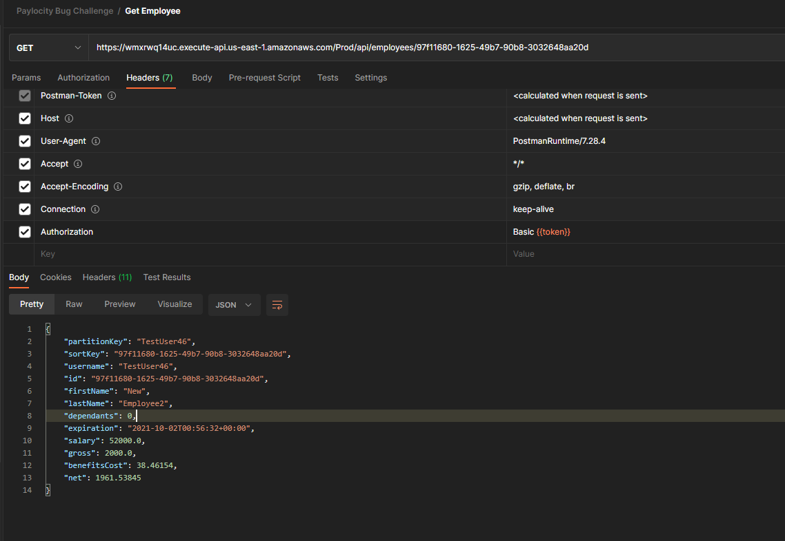
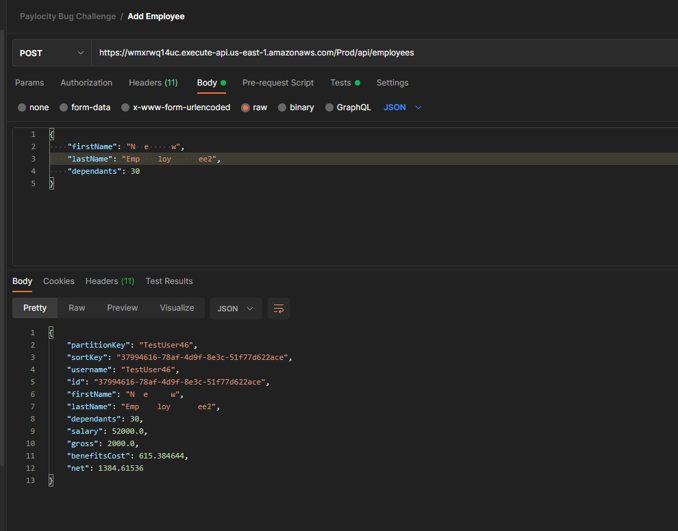

# API Defects

## GET requests
1. In the response body, dependants is mispelled, should be dependents

2. When you send a GET request with a non-existent id, a 200 OK response is returned with an empty body. Should review using another response code such as 404 Not Found.

## POST requests

1. Similar to the UI defect, when you send a POST request to add a new employee, it allows for a missing dependents value, then adds a value assuming 0. Should validate this from the back-end and front-end when possible.

2. Similar to the UI defect, you are able to send a POST request with first and last name values with numbers. Should validate this from the back-end and front-end when possible.

3. A POST request with an empty body, returns a 500 Internal Service Error, and 
 with a page describing an error occurred. A 400 Bad Request may be a better experience here, as with other validation errors for missing values.
 
4. A POST request, with spaces in the first and last names is accepted. 

## PUT requests

1. When you send a PUT request for a non-existent employee, it returns a 200 OK response, and behaves as 
    creating a new employee
    - In addition,  it creates the user with a 0 annual salary, 0 gross, calculates, benefits, and shows a 
      negative net value. This is displayed in the API value and also the front-end.
  

