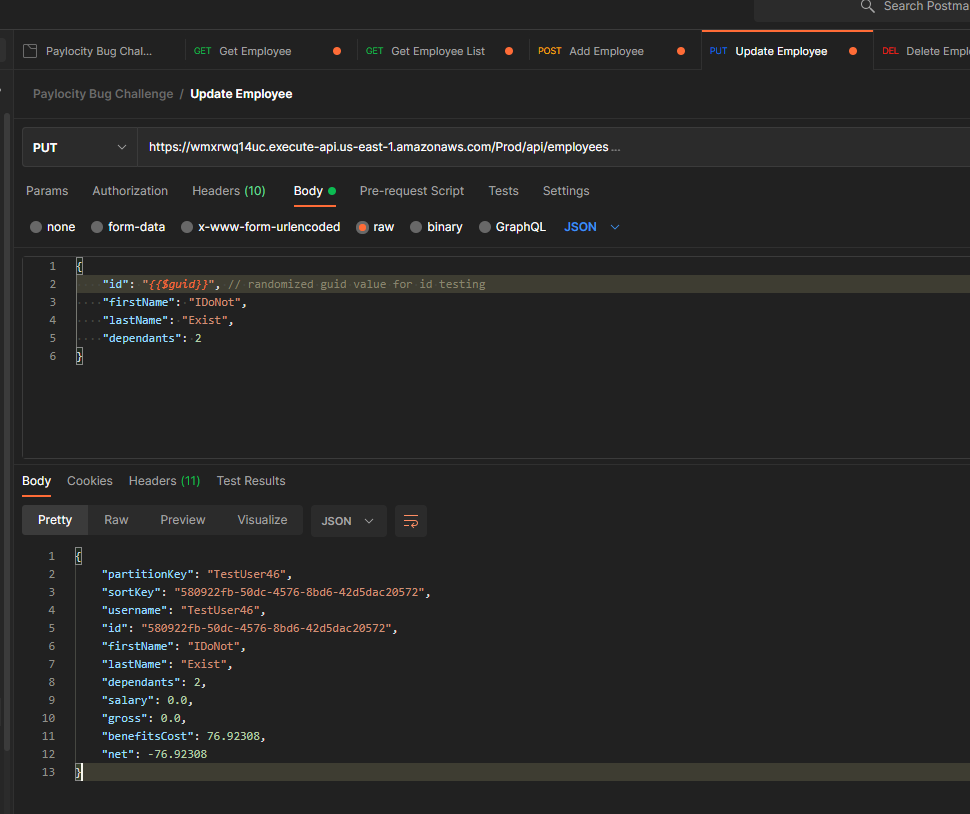
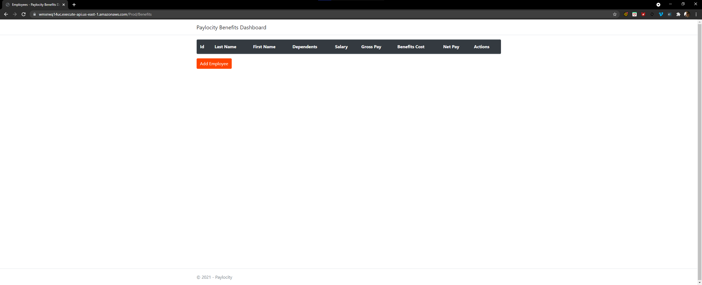
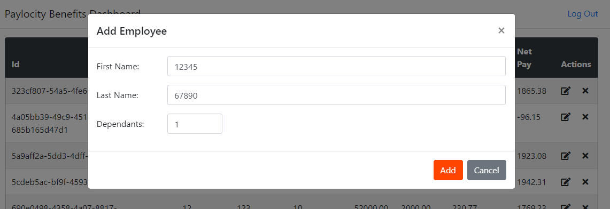
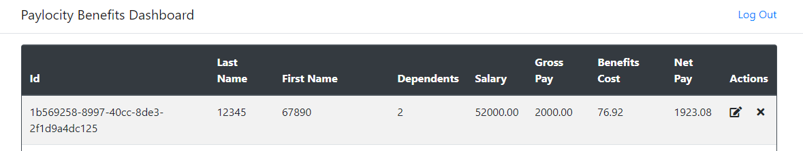

# Detailed Defects

## 1. API: PUT request to Update Employee adds a new one instead

1. Access the API endpoint (https://wmxrwq14uc.execute-api.us-east-1.amazonaws.com/Prod/api/employees)
    1. Can use an API testing application such as Postman or Insonmia for example
2. Send a PUT request to the endpoint
    1. Make sure to include the Authorization Token
    3. In the request body, include a value of a non-existent user
        1. example Body:
            ```
            {
            "id": "{{$guid}}", // enter any guid value here, that is not a current employee
            "firstName": "IDoNot",
            "lastName": "Exist",
            "dependants": 2 // any value from 0 to 32
            }
            ```
    4. The response returns a 200 OK value, and the response body shows
        1. Negavite "net" value
        2. 0.0 "salary" value
        3. 0.0 "gross" value
    


## 2. UI: Able to access the Dashboard page without authentication

1. Copy and paste the following link into the address bar and press enter
    1. https://wmxrwq14uc.execute-api.us-east-1.amazonaws.com/Prod/Benefits
2. The Dashboard page will display, but empty, without accessing the login page first.



## 3. UI: Able to enter numeric values for first and last name

1. Access the Paylocity Benefits Dashboard 
2. Enter login credentials
3. Click the "Add Employee" button
4. Fill out the form with the following values:

5. Press Add
6. The application allows an employee name with numeric values to be created

