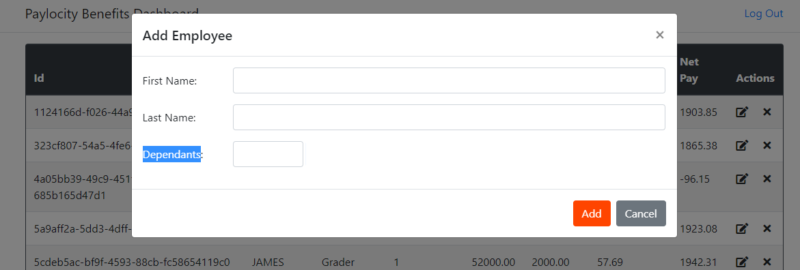
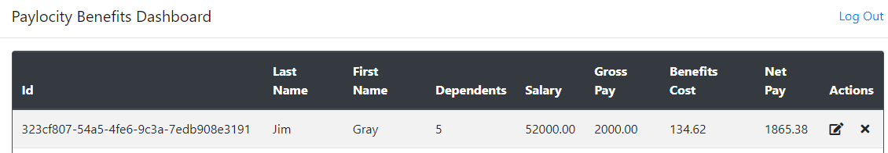
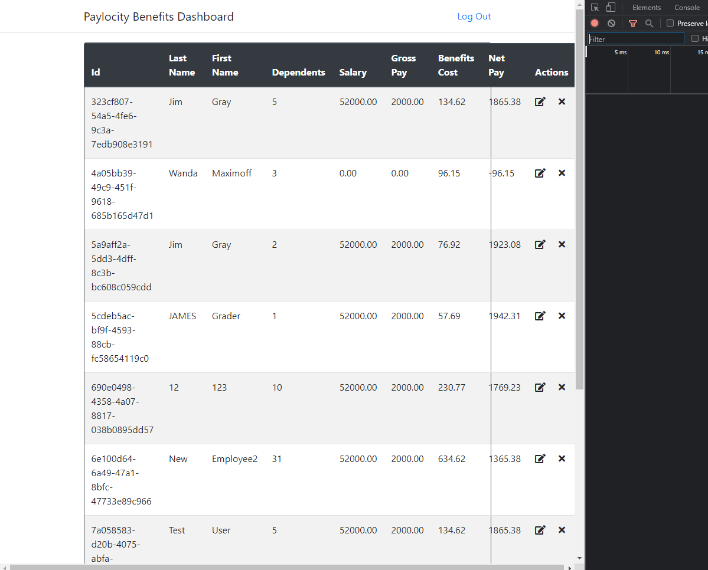

# UI Defects

- "Dependants" is mispelled, should be "Dependents"

- Selecting Edit Employee icon shows "Add Employee" header, 
  - "Edit Employee" or "Update Employee" may be more appropriate

- Allowed to enter a numerical value for a first and last name
    - Recommend adding a block to certain non-alpha values

- Theres a minimum and maximum number of dependents allowed (0 to 32), but it is not displayed in the UI. 
    - Can only find by checking the API response in DevTools

- Able to add a user with a blank dependent field, it assumes 0.

- No error message displayed when entering First OR Last Name as blank

- Last Name and First Name headers are reversed

- When the application has timed out, no indication this has happened
	- only when you try to attempt any action, and there's no response

- At a breakpoint size of 972px wide, the display shows a line thru Net Pay

- Can reach the dashboard page without authentication, recommended design would be to re-direct to the login page if not authenticated: 
    - https://wmxrwq14uc.execute-api.us-east-1.amazonaws.com/Prod/Benefits

